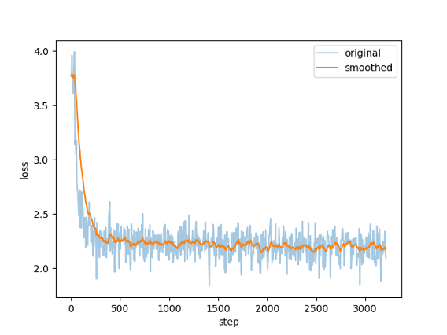
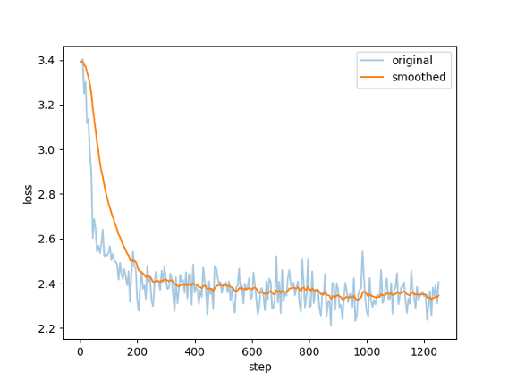

# ChatGLM2-6B-Chinese-medical
对ChatGLM2-6B-Chat进行了指令监督微调、推理速度优化和中文医疗方向微调。

# 项目概况
LLaMA-Factory是大模型训练和评估的平台，整合了目前主要的开源大模型，包含Baichuan、BLOOM、ChatGLM3、LLaMA、Qwen等，可以使用可视化界面实现模型训练和评估。本项目基于LLaMA-Factory，使用单GPU训练，对基座模型ChatGLM2-6B-Chat进行指令监督微调和推理效率优化，并且基于自己的研究方向在医疗方面进行了微调，实现了自己的Chat机器人。

# 1.基座模型
基座模型选择ChatGLM2-6B-Chat。ChatGLM2-6B是开源中英双语对话模型ChatGLM-6B的二代版本，使用GLM的混合目标函数，经过了1.4T中英标识符的预训练与人类偏好对齐训练，相关评测结果显示，它保留了初代模型的众多优秀特性，同时性能有了大幅提升，此外，基于Multi-Query Attention技术，ChatGLM2-6B-Chat有更高效的推理速度和更低的显存占用。除ChatGLM2-6B-Chat的性能优势外，选择的另一个原因是孙思邈中文医疗大模型Sumsimiao是基于Baichuan-7B和ChatGLM-6B在中文医疗数据上微调而得，参考已有的成果，在项目中也将对ChatGLM2-6B进行中文医疗方向的微调。
```c
git clone https://huggingface.co/THUDM/chatglm2-6b
```

# 2.初步指令微调
使用alpaca_zh中文语料对ChatGLM2-6B-Chat进行简单的指令微调。

命令
```c
CUDA_VISIBLE_DEVICES=0 python src/train_bash.py \
    --stage sft \
    --do_train True \
    --model_name_or_path /home/cent/lyq/code/chatglm2-6b \
    --finetuning_type lora \
    --template chatglm2 \
    --dataset_dir data \
    --dataset alpaca_zh \
    --cutoff_len 1024 \
    --learning_rate 5e-05 \
    --num_train_epochs 1.0 \
    --max_samples 51461 \
    --per_device_train_batch_size 4 \
    --gradient_accumulation_steps 4 \
    --lr_scheduler_type cosine \
    --max_grad_norm 1.0 \
    --logging_steps 5 \
    --save_steps 100 \
    --warmup_steps 0 \
    --neftune_noise_alpha 0 \
    --lora_rank 8 \
    --lora_dropout 0.1 \
    --lora_target query_key_value \
    --output_dir saves/ChatGLM2-6B-Chat/lora/train_2024-01-06-15-33-58 \
    --fp16 True \
    --plot_loss True
```

测试样例
```c
instruction:  "编辑文章，使其更吸引读者。",
input:  "自主机器人是计算机控制的机器，被编程执行特定任务而不需要任何人类输入。自主机器人在各个行业中被越来越广泛地应用，从制造业到医疗保健再到安全。",
output:  "自主机器人是计算机控制的机器，被编程执行特定任务而不需要任何人类输入，从而实现了新的效率、精确度和可靠性水平。自主机器人在各个行业中被越来越广泛地应用，从制造业，它们可以使用精度和一致的质量组装复杂的组件，到医疗保健，可以协助进行医疗测试和处理，再到安全，可以监控大面积地区，保障人们和财产的安全。自主机器人还可以减少在危险或有害环境中的错误和增加安全，在工业流程的检查或维修期间等。由于其多样性，自主机器人将彻底改变我们工作方式的方式，使任务变得更加简单、快速，最终更加愉悦。"
```




# 3.模型效率优化
使用QLoRA和Flash Attention技术优化模型的推理速度。

模型量化是指使用精度更低的单位来表示模型的权重或中间层变量，以节省空间和加速模型推理速度。QLoRA是LoRA的量化版本，在LoRA微调阶段进行量化，使用多个adapter减少性能损失，通过将梯度反向传播到低阶适配器LoRA中，以显著减少内存使用量，QLoRA引入NF4，NF4是一种新的数据类型，是信息理论上最优的数据类型。

注意力机制使模型能够以不同的方式权衡输入数据的不同部分，在执行任务时关注最相关的信息。当输入序列sequence length较长时，Transformer的计算过程缓慢且耗费内存，这是因为self-attention的time和memory complexity会随着sequence length的增加成二次增长，所以推理瓶颈在于Attention的计算是一个O(N²)的操作且无法并发。Flash Attention利用了类似动态规划的技巧，实现了online softmax，可以在一个循环中计算出一个分块的最终结果，将内存复杂度降低到线性O(N)。Flash Attention保持与传统注意力机制相同的准确度，它是注意力的精确表示，Flash Attention算法在遍历过程中需要不断地对中间结果进行重新计算，但是整个过程不需要读HBM，在增大了计算量的情况下仍然可以提升运算速度，有效利用硬件内存层次结构并最大限度地减少不必要的数据传输。

QLoRA
```c
CUDA_VISIBLE_DEVICES=0 python src/train_bash.py \
    --stage sft \
    --do_train True \
    --model_name_or_path /home/cent/lyq/code/chatglm2-6b \
    --finetuning_type lora \
    --quantization_bit 4 \
    --template chatglm2 \
    --dataset_dir data \
    --dataset alpaca_zh \
    --cutoff_len 1024 \
    --learning_rate 5e-05 \
    --num_train_epochs 3.0 \
    --max_samples 2000 \
    --per_device_train_batch_size 4 \
    --gradient_accumulation_steps 4 \
    --lr_scheduler_type cosine \
    --max_grad_norm 1.0 \
    --logging_steps 5 \
    --save_steps 100 \
    --warmup_steps 0 \
    --neftune_noise_alpha 0 \
    --lora_rank 8 \
    --lora_dropout 0.1 \
    --lora_target query_key_value \
    --output_dir saves/ChatGLM2-6B-Chat/lora/train_Qlora_test \
    --bp16 True \
    --plot_loss True 
```

Flash Attention
```c
CUDA_VISIBLE_DEVICES=0 python src/train_bash.py \
    --stage sft \
    --do_train True \
    --model_name_or_path /home/cent/lyq/code/chatglm2-6b \
    --finetuning_type lora \
    --template chatglm2 \
    --flash_attn True \
    --dataset_dir data \
    --dataset alpaca_zh \
    --cutoff_len 1024 \
    --learning_rate 5e-05 \
    --num_train_epochs 3.0 \
    --max_samples 2000 \
    --per_device_train_batch_size 4 \
    --gradient_accumulation_steps 4 \
    --lr_scheduler_type cosine \
    --max_grad_norm 1.0 \
    --logging_steps 5 \
    --save_steps 100 \
    --warmup_steps 0 \
    --neftune_noise_alpha 0 \
    --lora_rank 8 \
    --lora_dropout 0.1 \
    --lora_target query_key_value \
    --output_dir saves/ChatGLM2-6B-Chat/lora/train_flash_attn_test \
    --fp16 True \
    --plot_loss True
```

# 4.中文医疗方向优化
QiZhenGPT项目利用启真医学知识库构建的中文医学指令数据集，并基于此在LLaMA-7B模型上进行指令精调，大幅提高了模型在中文医疗场景下效果。将该项目下的sft-20k.json文件导入data路径，修改dataset_info.json文件，对ChatGLM2-6B-Chat进行中文医疗方向的指令微调。

数据集
```c
wget https://github.com/CMKRG/QiZhenGPT/blob/main/data/train/sft-20k.json
```

命令
```c
CUDA_VISIBLE_DEVICES=0 python src/train_bash.py \
    --stage sft \
    --do_train True \
    --model_name_or_path /home/cent/lyq/code/chatglm2-6b \
    --finetuning_type lora \
    --template chatglm2 \
    --flash_attn True \
    --dataset_dir data \
    --dataset sft-20k \
    --cutoff_len 1024 \
    --learning_rate 5e-05 \
    --num_train_epochs 1.0 \
    --max_samples 20000 \
    --per_device_train_batch_size 4 \
    --gradient_accumulation_steps 4 \
    --lr_scheduler_type cosine \
    --max_grad_norm 1.0 \
    --logging_steps 5 \
    --save_steps 100 \
    --warmup_steps 0 \
    --neftune_noise_alpha 0 \
    --lora_rank 8 \
    --lora_dropout 0.1 \
    --lora_target query_key_value \
    --output_dir saves/ChatGLM2-6B-Chat/lora/train_2024-01-07-14-56-24 \
    --fp16 True \
    --plot_loss True
```

测试样例
```c
instruction:  "盐酸四环素醋酸可的松眼膏是处方药吗",
input:  "",
output:  "处方药"
```




# 5.总结
在本项目中，基于LLaMA-Factory项目对ChatGLM2-6B-Chat模型进行了指令监督微调，对LLM的指令微调有了进一步的学习和实践，尝试使用QLoRA和Flash Attention技术优化了推理速度，最后，从感兴趣的探索方向出发，对ChatGLM2-6B-Chat进行了中文医疗方向的指令微调。

>下载本项目后，可直接添加适配器（saves/ChatGLM2-6B-Chat/lora路径下的train开头的文件）加载微调后的模型

>具体在技术报告中


